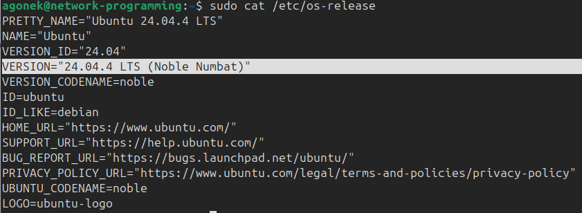
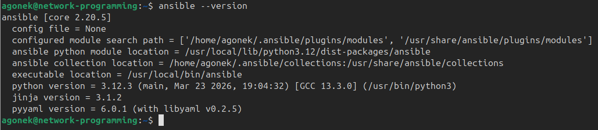
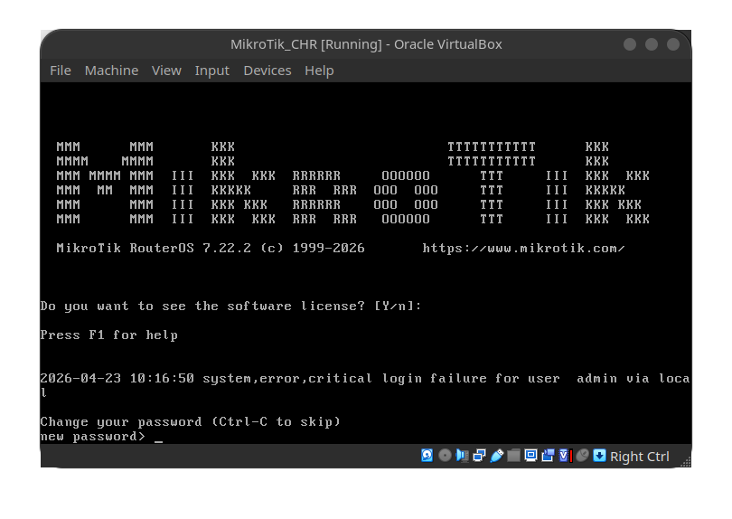
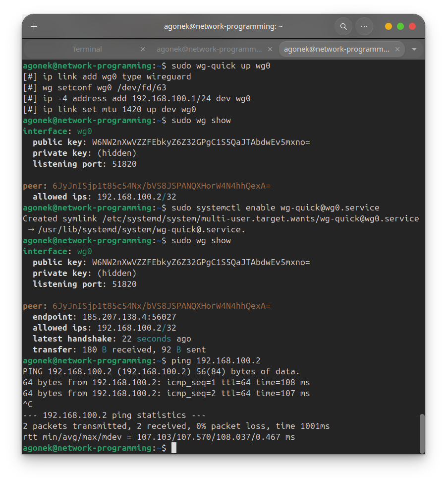

# header
- University: [ITMO University](https://itmo.ru/ru/)
- Faculty: [FICT](https://fict.itmo.ru)
- Course: [Network programming](https://github.com/itmo-ict-faculty/network-programming)
- Year: 2025/2026
- Group: K3321
- Author: Lapshina Yulia Sergeevna
- Lab: Lab1
- Date of create: 23.04.2026
- Date of finished: 23.04.2026

# 1. Создание ВМ

Я развернула ВМ в Yandex Cloud, прокинув для доступа свой ssh ключ. Я смогла выбрать 24.04 версию ubuntu, поэтому обновление не понадобилось (ну, почти).



# 2. Установка ansible

Выполнила следующие команды по установке нужного софта:
```
sudo apt update && sudo apt install python3-pip && sudo pip3 install ansible --break-system-packages
```



# 3. Установка CHR

Всё выполняла по [инструкции](https://help.mikrotik.com/docs/spaces/ROS/pages/262864931/CHR+installing+on+VirtualBox): скачала vdi, создала ВМ с CHR в virtualbox:



# 4.1 Настрйока Wireguard

Снова воспользовалась [инструкцией](https://help.mikrotik.com/docs/spaces/ROS/pages/69664792/WireGuard), а конкретнее `RoadWarrior WireGuard tunnel` и выполнила на CHR следующее:

```
/interface wireguard
add listen-port=13231 name=wireguard1
/ip address
add address=192.168.100.2/24 interface=wireguard1
```

```
/interface wireguard print
```

```
/interface wireguard peers add interface=wireguard1 public-key="<pub key Linux>" allowed-address=192.168.100.1/32 endpoint-address=<pub ip Linux> endpoint-port=51820 persistent-keepalive=25
```

```
/ip firewall filter add action=accept chain=input dst-port=51820 protocol=udp src-address=103.76.54.9
```




А на ВМ это (вот тоже [инструкция](https://serverspace.ru/support/help/kak-ustanovit-wireguard-vpn-client-na-ubuntu-linux/?utm_source=google.com&utm_medium=organic&utm_campaign=google.com&utm_referrer=google.com)):

```
sudo apt-get install wireguard
```

```
wg genkey | tee private.key | wg pubkey > public.key
```

```
sudo nano /etc/wireguard/wg0.conf
```

```
[Interface]
PrivateKey = <private key Linux>
Address = 192.168.100.1/24
ListenPort = 51820
[Peer]
PublicKey = <pub key CHR>
AllowedIPs = 192.168.100.2/32
```

# 4.2 Результат

Поднимем wireguard, посмотрим на конфиг и пропингуем CHR:

```
sudo wg-quick up wg0
sudo wg show
```


# ?. Полезные ссылки
[CHR: installing on VirtualBox](https://help.mikrotik.com/docs/spaces/ROS/pages/262864931/CHR+installing+on+VirtualBox)
[WireGuard - RouterOS - MikroTik Documentation](https://help.mikrotik.com/docs/spaces/ROS/pages/69664792/WireGuard)
[Wireguard Linux](https://serverspace.ru/support/help/kak-ustanovit-wireguard-vpn-client-na-ubuntu-linux/?utm_source=google.com&utm_medium=organic&utm_campaign=google.com&utm_referrer=google.com)