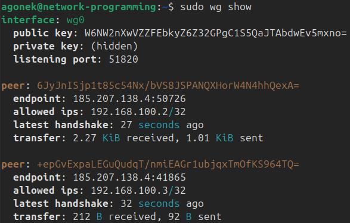

# header
- University: [ITMO University](https://itmo.ru/ru/)
- Faculty: [FICT](https://fict.itmo.ru)
- Course: [Network programming](https://github.com/itmo-ict-faculty/network-programming)
- Year: 2025/2026
- Group: K3321
- Author: Lapshina Yulia Sergeevna
- Lab: Lab2
- Date of create: 27.04.2026
- Date of finished: 27.04.2026
# 1. Плюс один CHR и настройка wireguard
По аналогии с первой лабораторной работой настроила второй chr и добавила новый peer в wireguard конфиг:


Включила форвардинг для пересылки трафика между роутерами:
```
sudo sysctl -w net.ipv4.ip_forward=1
```

Добавила в allowed-addresses chr'ов друг друга.
```
/interface wireguard peers set [find interface=wireguard1] allowed-address=192.168.100.1/32,192.168.100.2/32
```

Так как для ансибла нужен доступ к chr по ssh, то я выполнила проверку активности ssh с помощью `/ip service print`, и ssh уже был включен:


Ещё заменила пароль у админа, чтобы не было проблем с интерактивным вводом при подключении ансибла.

# 2.1 Ansible
Создала костяк директории с ансиблом, решила, что логика настройки будет реализована в роли, которая будет переиспользована в плейбуке. Инициализировала структуру роли с помощью `ansible-galaxy role init setup_chr`. Помимо роли с логикой настройки логина/пароля, ntp client, ospf я написала два плейбука - collect_facts и setup_chr - первый собирает конфиг ospf, а второй запускает роль с настройкой. Отдельно оформила файл inventory.yml (содержит chr'ы и переменные подключения), ansible.cfg (содержит настройки для ансибла и его подключения) и requirements.yml (содержит необходимые для работы коллекции). Итого:


Переместила директорию ансибла со всем содержимым на ВМ:
```
scp -r ansible agonek@<VM PUB IP>:/home/agonek/
```

Установила requirements:
```
ansible-galaxy collection install -r requirements.yml
```

И установила нужную для подключения к роутерам библиотеку:

```
python3 -m pip install ansible-pylibssh --break-system-packages
```

Запустила плейбук с настройкой:


# 2.2 Результат

Проверим юзера и ntp:

```
/system ntp client print
/user print detail
```


Запустим `collect_facts.yml`:


Итоговые файлы конфигов сохранены в `outputs/<CHR1, CHR2>/collect.txt`.

# 3. Схема

# ?. Полезные ссылки
- [Routeros commands ansible docs](https://docs.ansible.com/projects/ansible/latest/collections/community/routeros/command_module.html)
- [NTP mikrotik docs](https://help.mikrotik.com/docs/spaces/ROS/pages/40992869/NTP)